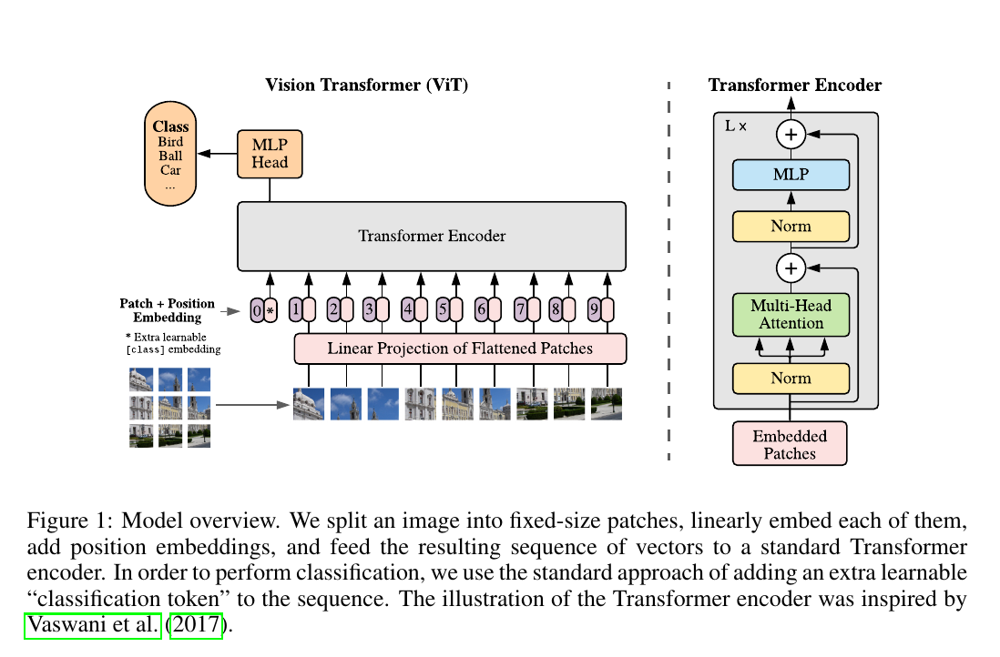

#NOTES

1. Input
   - we ∈ RH×W ×C into a reshape the image x2 sequence of flattened 2D patches xp ∈ RN ×(P ·C), where (H, W ) is the resolution of the original image, C is the number of channels, (P, P ) is the resolution of each image patch, and N = HW/P 2 is the resulting number of patches.
   - we prepend a learnable embedding to the sequence of embedded patches (z00 = xclass ).
   - The classification head is implemented by a MLP with one hidden layer at pre-training time and by a single linear layer at fine-tuning time.
   - Position embeddings are added to the patch embeddings to retain positional information. We use standard learnable 1D position embeddings.
   - alternating layers of multiheaded self-attention (MSA, see Appendix A) and MLP blocks (Eq. 2, 3). Layernorm (LN) is applied before every block, and residual connections after every block 
   - [MLP](MLP.png)
   - [Self Attention](SelfAttention.png)